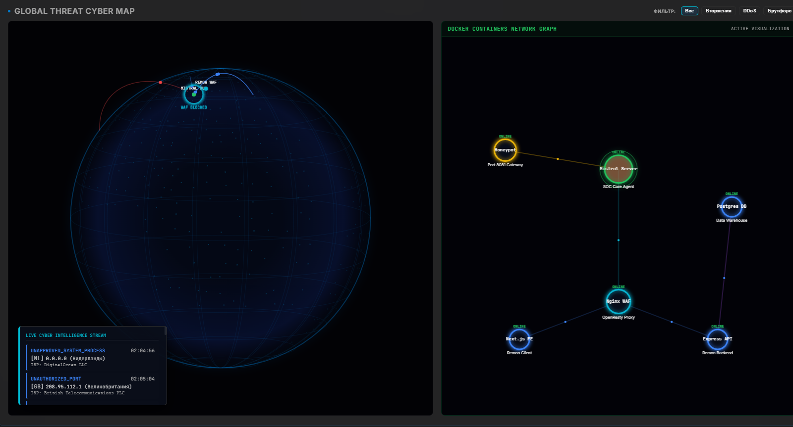
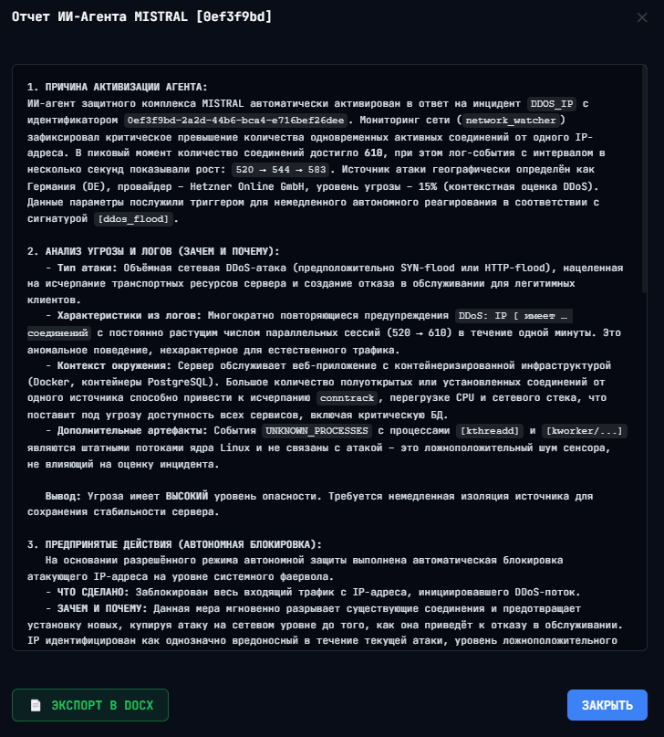
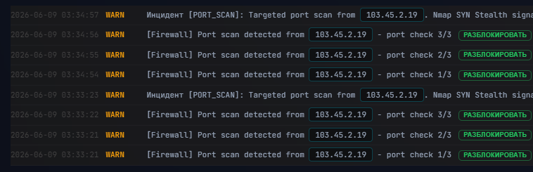
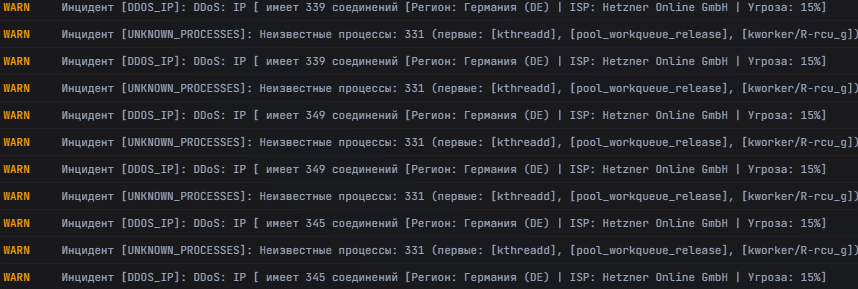
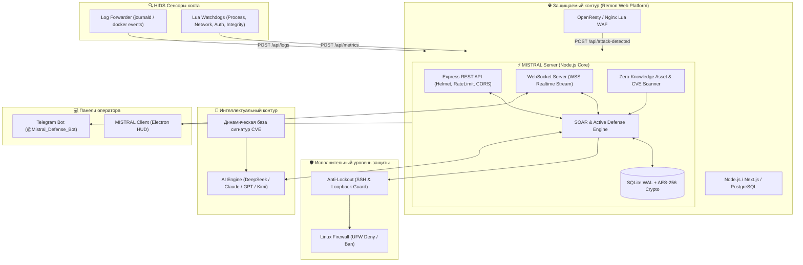

# 🛡️ MISTRAL Defense — Enterprise SOC & SOAR Server

<div align="center">

<br>


[](https://github.com/yousioks/Mistral_Server/actions/workflows/security.yml)

**Центральное серверное ядро распределенного комплекса мониторинга, анализа и автоматического реагирования на инциденты информационной безопасности (SIEM / SOAR / XDR).**

[Архитектура](#-архитектура-системы) • [Скриншоты](#-демонстрация-работы-скриншоты) • [Возможности](#-ключевые-возможности) • [Эшелоны защиты](#-эшелонированная-активная-защита) • [Быстрый старт](#-быстрый-старт) • [Структура](#-структура-проекта) • [API](#-спецификация-api)

</div>

---

## 📌 Обзор

**MISTRAL Server** — это высокопроизводительное серверное ядро, предназначенное для сбора телеметрии защищаемой инфраструктуры, обнаружения кибератак в реальном времени, управления политиками межсетевых экранов (UFW / Fail2ban) и автоматической выработки сценариев противодействия с помощью локальных детерминированных правил и генеративного искусственного интеллекта.

Разработано в рамках выпускной квалификационной работы по направлению «Информационная безопасность». Система решает проблему сокращения среднего времени реагирования на инциденты (**MTTR**) с десятков минут до нескольких секунд.

---

## 📸 Демонстрация работы (Скриншоты)

<div align="center">

### 🌍 Топология инфраструктуры и 3D кибер-карта векторов атак
*Мониторинг сети сервисов в реальном времени (Honeypot, Mistral Server, Nginx WAF, Next.js, Express, Postgres) и визуализация трассировки угроз:*



<br><br>

### 🧠 Автономный отчет расследования ИИ-агента
*Нейросеть в реальном времени проанализировала DDoS-атаку из Hetzner, сопоставила логи и выполнила автоблокировку в фаерволе:*



<br><br>

### 🚨 Детекция сканирования портов Nmap и управление UFW
*Фиксация скрытого SYN-сканирования портов с интерактивным управлением правилами сетевой изоляции:*



<br><br>

### 📡 Поток корреляции угроз и телеметрии атак
*Потоковый анализ DDoS-сессий с определением GeoIP источника и фоновых процессов:*



</div>

---

## 🏗️ Архитектура системы



---

## 🌟 Ключевые возможности

### 1. 📡 Потоковая обработка событий в реальном времени
- **Двунаправленный WebSocket-канал (WSS)**: мгновенная передача инцидентов, логов, телеметрии хоста и алертов на десктопные терминалы операторов без необходимости опроса (polling).
- **Log Forwarder**: потоковый сборщик событий `systemd-journald` (syslog) и `docker events` с интеллектуальной нормализацией сырых событий в структурированный JSON.

### 2. 🔍 Zero-Knowledge Asset Discovery & CVE Banner Scanner
- **Автоматическая инвентаризация Nginx**: модуль `discoverNginxSites()` сканирует `/etc/nginx/sites-enabled/` на лету, извлекая обслуживаемые домены, порты и Document Root без захардкоженных путей.
- **Инспекция Docker Runtime**: опрос состояния контейнеров, образов, сопоставления портов и статусов работоспособности.
- **Сигнатурный CVE-анализ баннеров**:
  - `CVE-2024-6387` (**regreSSHion**): проверка версий OpenSSH (8.5p1–9.7p1) на критическую уязвимость RCE.
  - `CVE-2023-44487` (**HTTP/2 Rapid Reset**): аудит конфигурации Nginx и веб-серверов.

### 3. 🧠 Интеллектуальный SOAR-движок (AI-Driven Mitigation)
- **Два режима работы ИИ-агента**:
  - **Автономный режим (Autonomous Active Defense)**: ИИ анализирует атаку, формирует тег `[AUTOBAN: IP]`, сервер автоматически изолирует злоумышленника через UFW и генерирует структурированный Markdown-отчёт (`data/reports/*.md`).
  - **Информационный режим (Advisory Assistance)**: формирование для дежурного аналитика пошаговой инструкции с верифицированными bash-командами для ручного применения.
- **Динамическая база уязвимостей (`data/vulnerabilities/`)**: сигнатуры SQLi, DDoS, Brute Force, Ransomware, Privilege Escalation автоматически подмешиваются в контекст ИИ.

### 4. 🔒 Криптографическая защита базы данных
- **SQLite с режимом WAL** (`better-sqlite3`): максимальная скорость параллельной записи логов и инцидентов.
- **Симметричное шифрование AES-256-CBC**: чувствительные поля базы данных (детали инцидентов `details`, системные метаданные `meta` и API-ключи внешних языковых моделей) шифруются с использованием случайного IV перед записью в БД.

### 5. 🤖 Telegram-интеграция с экспресс-анализом ИИ
- Уведомления оператора в мессенджере с HTML-форматированием и индикацией уровня опасности (`CRITICAL`, `HIGH`, `MEDIUM`).
- Интерактивная кнопка **[ 🧠 АНАЛИЗ ИИ ]**: получение экспресс-сводки от нейросети прямо в чат Telegram для экстренного принятия решений.

---

## 🛡️ Эшелонированная активная защита

В ядро сервера интегрированы механизмы защиты от атак и отказоустойчивости:

| Механизм | Триггер / Инцидент | Описание алгоритма | Тип противодействия |
| :--- | :--- | :--- | :--- |
| **Self-Tampering Guard** | `SELF_TAMPERING_ATTEMPT` | Контроль целостности файлов сервера и конфигурации по хешам SHA-256 | HIDS Integrity Audit |
| **Permissions Lockdown** | `INSECURE_FILE_PERMISSIONS` | Автоматическое принудительное ограничение прав на конфигурационные файлы до `0600` | Active Self-Hardening |
| **Kernel Hardening Audit** | `ASLR_DISABLED`, `PTRACE_SCOPE_INSECURE` | Проверка флагов `sysctl` (ASLR, `ptrace_scope`, IP Forwarding) ядра Linux | OS Hardening |
| **Rogue Process Guard** | `UNAUTHORIZED_RUNNING_PROCESS` | Потоковый аудит запущенных процессов по строгому белому списку `process_whitelist.txt` | HIDS Process Audit |
| **Threat Intel Watchdog** | `MALICIOUS_C2_CONNECTION_DETECTED` | Сверка активных TCP-сокетов со встроенной базой репутации (Tor exit-nodes, C2, ботнеты) | Network XDR Filter |
| **Anti-Lockout SSH Guard** | *Защита администратора* | Автоматическое определение IP текущих SSH-сессий (`who`, сокет 22, env-переменные) и добавление в неблокируемый список | Fallback Protection |
| **Loopback Guard** | *Self-DoS Bypass* | Жесткий программный запрет блокировки адресов локальной петли (`127.0.0.1`, `localhost`, `::1`) | Self-DoS Prevention |

---

## 📁 Структура проекта

```text
Mistral Server/
├── .env.example                # Шаблон конфигурации переменных окружения
├── activate_security.sh        # Скрипт первоначальной настройки безопасности ОС (UFW, Fail2ban)
├── add_user.sh                 # Утилита добавления учетной записи оператора SOC
├── check_db.js                 # Диагностика целостности базы данных SQLite
├── Dockerfile                  # Контейнеризация серверного ядра
├── install_audit.sh            # Подключение хуков аудита системных вызовов ядра Linux
├── install_semgrep_trivy.sh    # Установка SAST/SCA сканеров Semgrep и Trivy
├── list_users.sh               # Вывод зарегистрированных пользователей системы
├── package.json                # Зависимости проекта и npm-скрипты
├── start.sh                    # Главный скрипт запуска сервера и фоновых демонов
├── stop.sh                     # Корректная остановка сервера и сборщиков
├── start_honeypot.sh           # Запуск ловушки Honeypot (порт 8081)
│
├── data/                       # Хранилище данных (не отслеживается в git)
│   ├── mistral.db              # База данных SQLite с включенным WAL
│   ├── unbannable_ips.json     # Белый список неблокируемых IP и CIDR-подсетей
│   ├── threat_intel_ips.json   # Локальная база репутационных угроз
│   ├── soar_settings.json      # Настройки триггеров автоматического реагирования
│   ├── vulnerabilities/        # JSON-сигнатуры актуальных векторов угроз
│   └── reports/                # Архив сгенерированных ИИ Markdown-отчетов (.md)
│
├── monitors/                   # Системные HIDS Lua-зонды
│   ├── run-monitors.sh         # Скрипт управления жизненным циклом зондов
│   ├── process_whitelist.txt   # Белый список разрешенных процессов
│   └── lua/
│       ├── monitor_system.lua     # Аудит CPU, RAM, диска, nginx, docker
│       ├── monitor_network.lua    # Анализ открытых сокетов и сетевых аномалий
│       ├── monitor_auth.lua       # Мониторинг /var/log/auth.log и SSH-сессий
│       ├── monitor_integrity.lua  # Контроль целостности критических файлов
│       └── monitor_sec_tools.lua  # Контроль работоспособности защитных демонов
│
└── src/                        # Исходный код сервера
    ├── server.js               # Главная точка входа: REST API, WSS, SOAR, Discovery
    ├── db.js                   # Модуль работы с SQLite, миграции, AES-256 шифрование
    ├── log_forwarder.js        # Демон перехвата логов systemd и Docker events
    ├── scanners.js             # Интеграция со сканерами безопасности Semgrep и Trivy
    └── telegram-bot.js         # Telegram-бот с поддержкой экспресс-диагностики ИИ
```

---

## 🚀 Быстрый старт

### Требования
- **Node.js** 18.0.0 или новее
- **npm** 9.0.0+
- **Linux (Ubuntu / Debian)** для полноценной работы HIDS/UFW или **Windows** в режиме локальной эмуляции

### 1. Клонирование и установка зависимостей
```bash
git clone https://github.com/yousioks/Mistral_Server.git
cd Mistral_Server
npm install
```

### 2. Настройка конфигурации
Создайте файл `.env` на основе примера:
```bash
cp .env.example .env
```
Заполните обязательные параметры:
```ini
# Порт сервера и секрет сессий
PORT=8080
JWT_SECRET=your_super_secret_jwt_key_here
DB_ENCRYPTION_KEY=32_byte_aes_encryption_key_here

# Интеграция с Telegram
TELEGRAM_BOT_TOKEN=your_telegram_bot_token
TELEGRAM_ADMIN_CHAT_ID=your_chat_id

# Интеграция с ИИ (AITunnel / OpenAI / DeepSeek)
AITUNNEL_API_KEY=your_ai_api_key
AI_MODEL=deepseek/deepseek-chat
```

### 3. Запуск сервера
**В режиме разработки (с автоперезагрузкой):**
```bash
npm run dev
```

**Запуск Telegram-бота:**
```bash
npm run bot
```

**Полный запуск на Linux-сервере (включая UFW, мониторы и Log Forwarder):**
```bash
chmod +x start.sh activate_security.sh monitors/run-monitors.sh
./activate_security.sh
./start.sh
```

---

## 📡 Спецификация API

### Аутентификация и пользователи
- `POST /api/auth/login` — авторизация оператора SOC (с защитой Rate Limit: максимум 5 попыток/мин).
- `GET /api/auth/me` — получение профиля текущего оператора.

### Инциденты и атаки
- `POST /api/attack-detected` — эндпоинт приема алертов от WAF и внешних сенсоров.
- `GET /api/incidents` — получение списка зафиксированных инцидентов безопасности.
- `POST /api/incidents/:id/resolve` — перевод инцидента в статус разрешенного.

### Карантин и управление блокировками
- `GET /api/quarantine` — текущий список изолированных хостов в брандмауэре.
- `POST /api/quarantine/ban` — ручная или SOAR блокировка IP (с проверкой Whitelist).
- `POST /api/quarantine/unban` — разблокировка хоста в UFW.
- `GET /api/whitelist` — список неблокируемых хостов и CIDR-подсетей.
- `POST /api/whitelist` — добавление доверенной подсети/IP в исключения.

### ИИ-аналитика и отчеты
- `POST /api/ai/task` — запуск задачи анализа инцидента ИИ-агентом.
- `GET /api/ai-reports` — архив аналитических отчетов в формате Markdown.
- `GET /api/ai-reports/:filename` — чтение конкретного отчета расследования.

---

## 📄 Лицензия

Проект разработан в учебных и исследовательских целях в рамках дипломного проекта по специальности «Информационная безопасность».
Распространяется под лицензией [MIT](LICENSE).
