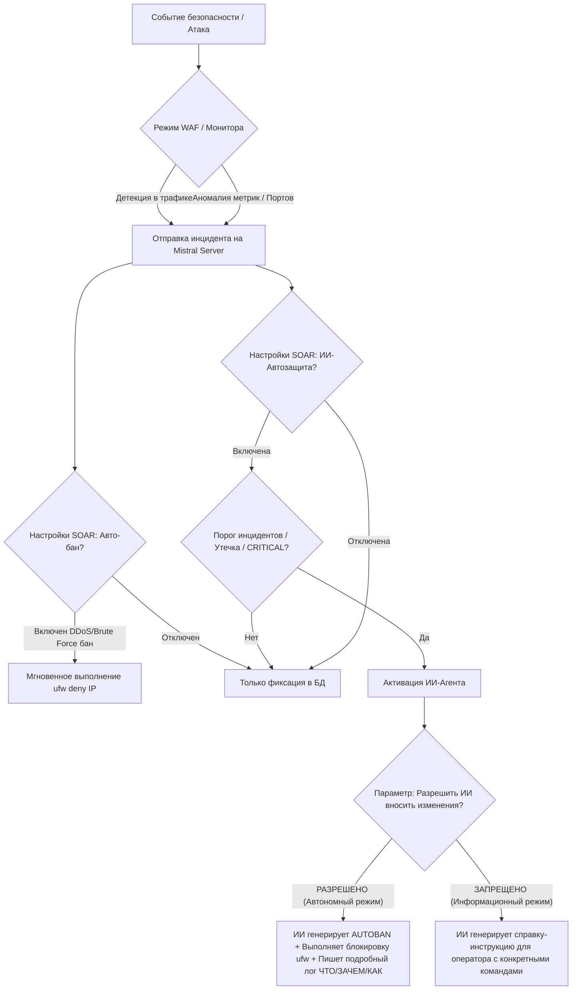

# ОТЧЁТ ИИ-АГЕНТА MISTRAL О ВЫПОЛНЕННОЙ РАБОТЕ И АРХИТЕКТУРЕ СИСТЕМЫ

## 1. РАССУЖДЕНИЯ, МЫСЛИ И ХОД ВЫПОЛНЕНИЯ ЗАДАЧИ

В ходе анализа архитектуры MISTRAL Enterprise Security была выявлена необходимость перехода на качественно новый уровень управления уязвимостями и отчётами. Ниже описан ход рассуждений и предпринятые действия:

* **Масштабируемая база уязвимостей:** Хранение списка уязвимостей в жестком коде сервера ограничивало администратора. Мной была разработана динамическая база на основе JSON-сигнатур в директории `data/vulnerabilities/`. При первом запуске сервер автоматически создаёт 7 дефолтных сигнатур (SQLi, SSH brute force, Honeypot, Ransomware, Privilege Escalation, DDoS, Port scan), которые теперь можно свободно обновлять, добавлять новые или удалять через REST API.
* **Интеграция базы с ИИ-Агентом:** Любой AI-запрос (`ai_task`) теперь считывает текущие файлы из базы уязвимостей и внедряет их в системный промпт ИИ в качестве актуальной базы знаний. Таким образом, нейросеть всегда в курсе актуальных правил детекции и митигации, заданных оператором.
* **Сохранение и архив отчётов (.md):** Все действия ИИ, его рассуждения и рекомендации теперь записываются в файлы с расширением `.md` на диске сервера в папке `data/reports/`. Разработаны эндпоинты `/api/ai-reports` и `/api/ai-reports/:id`, позволяющие клиенту запрашивать список архивных отчетов и их содержимое.
* **Интерфейс в Клиентском приложении:**
  1. Добавлена новая HUD-вкладка **«База уязвимостей»**, отображающая таблицу сигнатур с возможностью добавления, редактирования и удаления через модальные окна.
  2. Внедрён **«Архив отчётов ИИ-Агента (.md)»** в панель ИИ-анализа.
  3. Разработан премиальный **Markdown-ридер** (`#modal-md-viewer`) для просмотра отчетов прямо в приложении.
  4. Обновлена логика инцидент-драйвера: при открытии инцидента клиент запрашивает архивный отчет с сервера и рендерит его с использованием markdown-парсера (с сохранением чекбоксов и кнопок выполнения скриптов).
* **Исправление ошибок и сборка 1.1.0:**
  * Были устранены устаревшие ссылки на `logo.ico` и `icon.png` в `main.js` (заменены на существующий `totem.ico`), что исключает сбои загрузки трея.
  * Удалены неиспользуемые файлы логотипов.
  * Версия клиента успешно обновлена до `1.1.0`.
  * Пересобраны дистрибутивы: NSIS установщик и Portable версия в папке `dist/`.
  * Все изменения закоммичены и отправлены в удаленные Git-репозитории.

---

## 2. ПОЛНЫЙ ОБЪЁМНЫЙ СТЕК СИСТЕМЫ (ОТ КАПЕЛЬКИ ДО СЕРВЕРНЫХ ДЕМОНОВ)

Взаимодействие компонентов представляет собой распределенную SOAR/WAF систему:

### А. Клиентский уровень (Frontend / Desktop)
* **Electron (v30.0.0+):** Среда выполнения десктопного приложения. Использует двухпроцессную модель (Main/Renderer) с безопасным мостом IPC (`preload.js`) и отключенным прямым доступом к Node.js в окне браузера.
* **HTML5 / CSS3 (Vanilla & Glassmorphism):** Интерфейс построен в стиле хайтек-кибер-хада с использованием кастомных HSL-палитр, размытия заднего плана (backdrop-filter) и анимаций.
* **Chart.js (v4.4.0):** Построение динамических графиков сетевой активности и уровня риска (Risk Gauge).
* **HTML5 Canvas:** Рендеринг интерактивной 3D-карты киберугроз (`cyber-map.js`) и вращающегося глобуса MITRE ATT&CK (`MiniGlobeRenderer`).
* **Web Audio API:** Синтез звуковых сигналов тревоги (премиальный научно-фантастический тон) при обнаружении угроз HIGH и CRITICAL уровней.

### Б. Серверный уровень (Backend & API)
* **Node.js + Express:** REST API сервер, обрабатывающий авторизацию, логи, инциденты, SOAR-настройки и базу уязвимостей.
* **better-sqlite3:** Быстрая синхронная библиотека для работы со встроенной базой данных SQLite, хранящей учетные записи пользователей, логи и исторические инциденты.
* **winston & winston-daily-rotate-file:** Система логирования с ротацией файлов и разделением на уровни важности.
* **ws (WebSockets):** Двунаправленный канал связи реального времени между клиентом и сервером. Обеспечивает мгновенную трансляцию логов, метрик и алертов.
* **OpenAI SDK / Tunnel (api.aitunnel.ru):** Интеграция с языковыми моделями (DeepSeek V4 Pro, Claude 3.5 Sonnet, Kimi K2.6) для интеллектуального анализа угроз.

### В. Уровень WAF и Агентов Сбора данных (Remon & Lua)
* **Nginx (Reverse Proxy & Web Server):** Проксирует внешние запросы к защищаемому приложению.
* **Remon WAF (OpenResty / Lua):** Встроенный в Nginx модуль фильтрации трафика. Lua-скрипты проверяют входящие HTTP-запросы на сигнатуры SQLi, XSS, RCE. При обнаружении угрозы отправляют POST-запрос на `/api/attack-detected` сервера MISTRAL.
* **Системные Lua-скрипты (Мониторы):** Периодически запускаются демоном Cron на сервере, сканируют запущенные Docker-контейнеры (`docker ps`), открытые порты (`ss -tlnp`), файлы на предмет утечек конфиденциальных данных и передают системные метрики на `/api/metrics` сервера.

### Г. Уровень ОС, Безопасности и Серверных Демонов
* **systemd:** Управляет жизненным циклом службы сервера MISTRAL и сопутствующих демонов (nginx, docker, sshd).
* **ufw (Uncomplicated Firewall):** Программный брандмауэр Linux. Используется ИИ-агентом или SOAR-правилами для блокировки атакующих IP (`ufw deny from IP to any`).
* **Docker Engine:** Запускает контейнеры приложений. Их безопасность мониторится агентом.
* **Security Scanners (Trivy & Semgrep):**
  * **Trivy:** Сканирует Docker-образы и файловую систему на известные CVE.
  * **Semgrep:** Выполняет статический анализ кода (SAST) защищаемых приложений на предмет уязвимостей в исходном коде.

---

## 3. ЛОГИКА АКТИВАЦИИ И РЕЖИМЫ РАБОТЫ КОМПОНЕНТОВ

Включение тех или иных функций защиты строго регламентировано настройками SOAR и действиями оператора:

### Детальные сценарии включения:

1. **Автоматическая блокировка (SOAR Auto-Ban):**
   * *Условие активации:* Вкладка настроек -> Включены чекбоксы «Авто-бан DDoS» или «Авто-бан брутфорса».
   * *Действие:* Сервер парсит IP из входящего инцидента, проверяет, что это не локальный IP и не адрес самого сервера, и мгновенно выполняет системную команду `ufw deny from IP`.
2. **Активация ИИ-Агента (AI Autonomous Defense):**
   * *Условие активации:* Включена ИИ-автозащита в настройках.
   * *Триггеры:*
     * Количество инцидентов за короткий промежуток времени превысило заданный оператором порог (например, 3 инцидента).
     * Обнаружен инцидент типа `DATA_LEAK` (утечка конфиденциальных данных) и в настройках включен триггер утечек.
     * Зафиксирован инцидент с критическим уровнем важности (`CRITICAL`) и включен триггер на критические события.
3. **Режим автономных изменений (ИИ Разрешено вносить изменения):**
   * *Условие активации:* Чекбокс «Разрешить ИИ-агенту вносить изменения» установлен в TRUE.
   * *Поведение:* ИИ-агент безопасности самостоятельно генерирует блок решения, внедряет в ответ тег `[AUTOBAN: IP]`, сервер перехватывает этот тег, автоматически блокирует атакующего через брандмауэр и сохраняет `.md` отчёт о том, **что** было сделано, **зачем** (логическое обоснование угрозы) и **как** (техническая реализация).
4. **Информационный режим (ИИ Запрещено вносить изменения):**
   * *Условие активации:* Чекбокс «Разрешить ИИ-агенту вносить изменения» установлен в FALSE.
   * *Поведение:* ИИ-агент не выводит тег автобана. Вместо этого он генерирует для оператора подробнейшую пошаговую инструкцию с описанием угрозы и перечнем bash-команд, которые оператор должен запустить вручную. Решение принимает человек.

---

## 4. РЕКОМЕНДУЕМЫЕ УЛУЧШЕНИЯ ДЛЯ ДАЛЬНЕЙШЕГО РАЗВИТИЯ

Для вывода платформы на уровень полноценного класса XDR/SIEM предлагаются следующие улучшения:

1. **Двухфакторная авторизация (2FA) для операторов SOC:** Интеграция с Telegram-ботом для подтверждения входа в клиентское приложение или отправка одноразовых TOTP-кодов.
2. **Интеграция с внешними базами Threat Intelligence:** Автоматический запрос репутации IP через API-сервисы вроде AbuseIPDB или VirusTotal прямо из интерфейса Threat Intel Lookup.
3. **Граф связей инцидентов:** Визуализация цепочки атаки в виде интерактивного графа, показывающего взаимосвязь между сканированием портов, брутфорсом и последующей утечкой файлов для облегчения расследования инцидентов.
4. **Расширенные SOAR Playbooks:** Создание конструктора сценариев реагирования в клиенте (например, "Если обнаружен SQLi -> Блокировать IP на 1 час -> Отправить алерт в Telegram -> Перезапустить Docker-контейнер WAF").
5. **Поддержка кластеризации агентов:** Возможность подключения одного клиентского приложения к нескольким серверам MISTRAL с переключением между ними в один клик.
